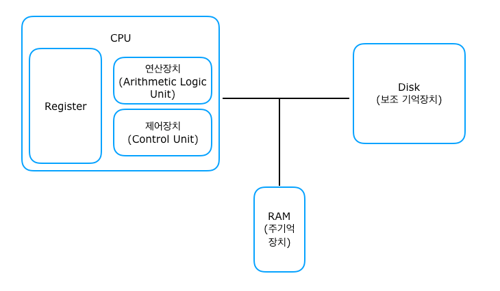

# Process

> 프로세스를 알기 위해선 컴퓨터 구조에 대한 여러가지 용어(?)와 흐름을 이해해야한다.



컴퓨터 시스템은 크게 **3가지**로 구성된다.

-   보조기억장치 : HDD/SDD => Storage
-   주기억장치 : RAM => Memory
-   CPU(중앙처리장치) : 명령어를 해석하는 부분 => Processor

`컴퓨터 시스템의 흐름`에 대해서 알아보자.

먼저, <u>왜 기억장치가 2 종류나 필요할까?</u> 아직 인류는 완벽한 기억장치를 만들지 못했다. 이 말인 즉슨, 많은 양이 저장되고 속도가 빠른 기억장치를 만들지 못했다는 것이다. 보조기억장치는 가격은 싸고 저장용량은 크다. 하지만 읽고 쓰는 속도가 느리다. 반면에 주기억장치는 읽고 쓰는 속도는 빠르지만 가격은 비싸고 저장용량 또한 작다. 그렇기때문에 컴퓨터는 2 종류의 기억장치를 모두 사용한다.

프로그램이 실행되는 과정을 컴퓨터 시스템의 흐름 속에서 이해해보자. **프로그램**은 어떤 문제를 해결하기 위해서, 특정 결과를 만들기 위해서 처리방법 및 순서를 적어놓은 **명령어의 집합** 이다. 이 프로그램은 보조기억장치, 우리가 하드라고 불리우는 곳에 저장된다. 이 프로그램에 적힌 <u>명령어를 프로세서라고 불리는 CPU가 읽어야 프로그램이 실행</u>이 된다. 하지만 프로세서는 매우 빠르기 때문에 상대적으로 느린 보조기억장치에서의 프로그램에 접근할 수 없다. 그래서 보조기억장치에 저장된 프로그램은 먼저 <u>주기억장치인 RAM에 적재(loading)</u>된다. 적재된 프로그램을 CPU가 읽어서 프로그램을 실행시킨다. 이 때 **실행되고 있는 프로그램의 상태를 프로세스**라고 한다.

<br/>

💡 **정리**

-   프로그램(Program) : 명령어의 집합
-   프로그램이 실행되는 Flow
    1. 보조기억장치(HDD) : 프로그램의 저장 위치
    2. 주기억장치(RAM)로 프로그램이 로딩
    3. 프로세서(CPU)에 의해서 프로그램에 적혀있는 명령어 해석
    4. 프로그램 실행
-   프로세스(Process) : 실행되고 있는 프로그램

## 프로세스 모니터링

> 프로세스를 모니터링 하는 프로그램을 실행시키는 명령어

<br/>

```
ps
ps aux
ps aux | grep apache
```

> `ps`는 process에 대한 약자로서 **현재 실행되고 있는 프로세스에 대한 리스트**를 보여준다.

> `ps aux`는 실행되는 프로그램을 포함하고 **백그라운드에서 돌아가는 프로세스까지** 모두 리스트업하여 보여준다.

> **[참고]** `ps -ef`는 **커널 프로세스를 제외한 모든 프로세스를 풀포멧형식**으로 보여준다.

> `ps aux | grep 프로세스명` 으로 해당 프로세스를 찾아서 그것만으로 보여준다.

```
sudo top
suto htop
```

> ps에서 리스트업해주는 것보다 프로세스 리스트를 <u>좀 더 보기쉽고 분석하기 쉽게 보여주는</u> 프로그램이다. ( **htop > top** )

## 백그라운드

https://pragp.tistory.com/entry/Linux%EB%A6%AC%EB%88%85%EC%8A%A4-fg-bg-kill-CtrlZ

## 데몬(Daemon)

-   개념

    우리가 사용하는 프로그램을 크게 2종류로 분류할 수 있다. 첫번째는 우리가 프로그램을 사용하고자 할 때 실행하는 프로그램과 두번째는 언제 필요할지 모르기 때문에 **항상 실행되고 있는 프로그램**이 있다. <u>데몬은 후자에 속한다</u>. 데몬이 항상 실행되고 있다는 의미는 항상 메모리(RAM)에 올라가 있다는 말이다. 이러한 프로그램은 일반적으로 서버(ftp서버, db서버, 웹서버 등), 서비스 관련 프로그램이 많다.

-   데몬의 실행 방식

1. **standalone type**

    독립적으로 수행되고 서비스 요청에 응답하기 위해서 항상 메모리에 올라가 있는 데몬을 말한다.(일반적으로 설명하는 데몬의 형태)

2. **inetd type**

    `inetd`라는 특별한 데몬에 의해서 간접적으로 실행되는 데몬을 말한다. 보안상의 이유로 `xinetd`로 수정되었으며 `슈퍼데몬`이라고 한다. 서비스 요청이 들어오면 슈퍼데몬이 요청된 데몬을 메모리에 올리고 요청을 처리한다.
