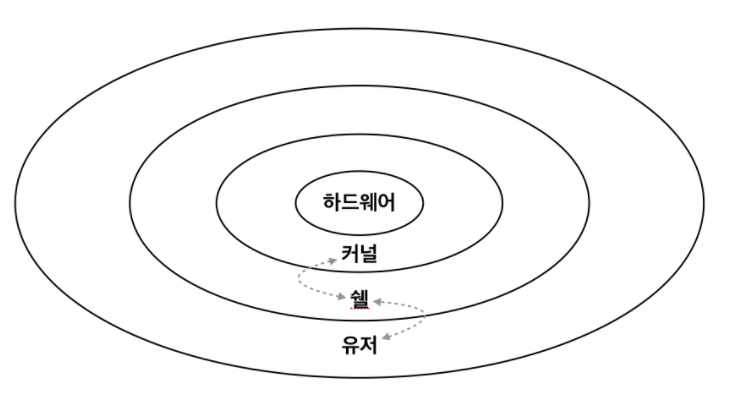

# Shell & Shell Script

## Shell vs Kernel

> 쉘과 커널을 비교하는 것을 통해서 쉘에 대해서 알아보자.

<br/>



> 쉘과 커널의 관계를 구조적으로 그린 이미지이다.

먼저 영어적인 뜻을 살펴보자. `shell`은 **껍데기**라는 의미이고 `kernel`은 **핵심**이라는 의미를 뜻한다. 이 의미를 음미하면서 위 이미지를 다시 보자. 가장 한 가운데, 중심에는 하드웨어가 있다. 이 하드웨어를 감싸고 있는것이 커널이고 그 위에 쉘이라는 것이 있다. 가장 바깥은 유저라고 적혀있다.(유저는 application을 뜻한다.)

하드웨어는 말 그대로 물리적인, 기계적인 것을 뜻한다. 즉 우리가 집에 있는 컴퓨터를 말한다. 우리는 컴퓨터를 제어하기 위해서 명령어를 사용한다.(물론 직접적으로 명령어를 치진않지만, 명령어로 구성된 프로그램을 사용한다.) 이 프로그램/명령어에 의해서 컴퓨터가 뭔가를 실행하게 되고 우리는 무엇인가를 컴퓨터를 통해서 할 수 있게 된다. 그 과정의 일련의 과정이 쉘과 커널을 통해서 이루어 진다. 좀 더 자세히 말하면, <u>우리가 사용한 명령어는 쉘이라는 프로그램을 통해서 해석되어서 커널에 전달되고, 그 커널은 해석된 명령어에 맞게 컴퓨터를 제어하게된다.</u>

## 다양한 쉘

```zsh
echo $0
> -zsh
```

> 위와 같은 명령어를 사용하면 내 컴퓨터에서 무슨 쉘을 사용하는지를 알 수 있다. 위 출력값은 `zsh` 를 사용한다는 의미

위에서 말했듯이 쉘은 명령어를 해석하여 커널에 전달하는 프로그램이다. 이러한 쉘은 다양하게 존재한다. 유저의 환경에 맞게 쉘을 선택하여 사용할 수 있다. 예를 들어 zsh 와 bash 라는 쉘이 있다. 둘은 비슷하지만 편의성 측면에서 다르다. 나 역시 bash를 사용하다가 zsh로 커스터마이징하였다. 다양한 편의성이 있지만 우선 예쁘다😽. ~~이거하나로 바꾼 보람이 있다.~~ 그 외 기능적으로 사용하는데 편리한 기능들이 많다. 필요에 따라서 자발적으로 찾아보는 것을 추천한다.

### 쉘의 종류

1. **sh(Bourne Shell)**

-   path : `/bin/sh`
-   가장 기본적인 쉘로서 유닉스 초기부터 사용되어온 쉘이다.

2. **ksh(Korn Shell)**

-   path : `/bin/ksh`
-   본 쉘을 확장한 쉘로서 본 쉘의 명령어를 모두 인식하며,명령어 히스토리(history) 기능과 앨리어스(alias), 작업 제어 등의 기능이 추가되었다. 명령어 편집기능을 제공한다.

3. **bash(Bourne Again Shell)**

-   실행파일 : `/bin/bash`
-   리눅스에서 가장 많이 사용되는 쉘이다. C 쉘과 콘 쉘의 장점을 결합하여 만들어진 쉘이다. GNU 프로젝트에 의해 만들어지고 배포되었다.

4. **csh(C 프로그램스타일의 Shell)**

-   path : `/bin/csh`
-   C언어 스타일의 쉘로서 최초에는 본 쉘이 갖지 못한 기능들(작업제어, 명령어 히스토리 등)을 갖고 등장하였다.

> 많은 쉘 프로그램들이 존재한다.

## Shell Script
